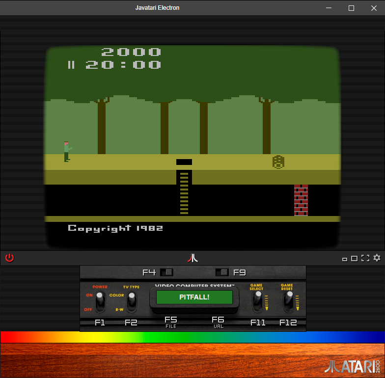

# Javatari Electron

[Javatari embedded](https://github.com/ppeccin/javatari.js/tree/master/release/stable/5.0/embedded) in an Electron desktop application

[Javatari](http://javatari.org/) is a cross platform Atari 2600 emulator designed for the Web.
And now you can play Atari 2600 games with touch controls on desktop, even when offline!

## Features

These features have been added without modifications to the emulator code, they are independent features and should not affect any emulator functionality.

- Added scanlines that emulates a CRT screen;
- Added a new overlay interface to simulate a CRT tube and remembering an atari box;

## Screenshot:

## To run this application:

1. Install dependencies: `npm install`
2. Start the app: `npm start`

## Credits
- Paulo Peccino ([@ppeccino](https://twitter.com/ppeccin)) for his amazing cross platform Atari 2600 emulator [Javatari.js](http://javatari.org/).
- David Crane ([@PitfallCreator](https://twitter.com/pitfallcreator)) for his adorable Pitfall game
illustrated in the [picture 1](https://github.com/arcostasi/javatari-electron/blob/master/img/screenshot.png?raw=true).
